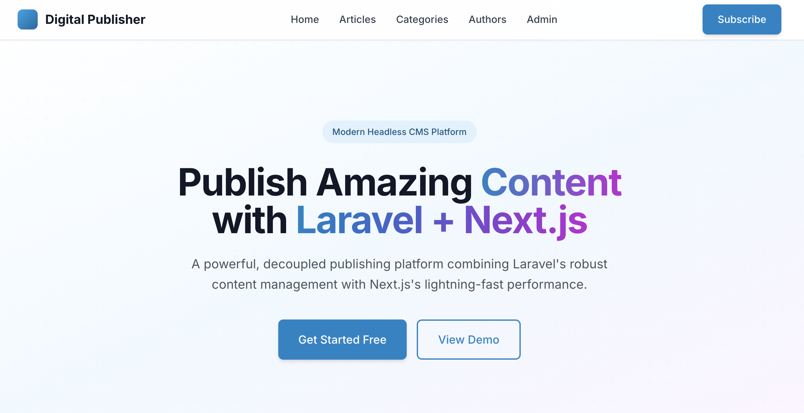
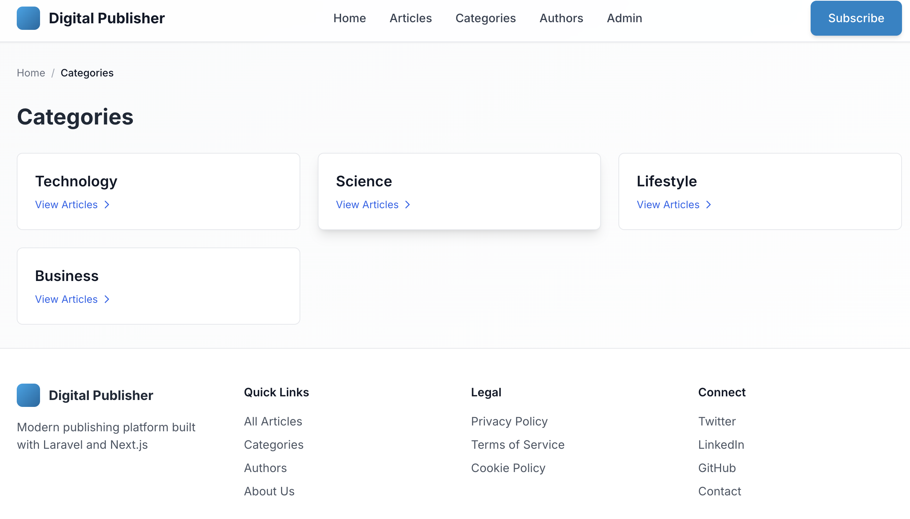

# Digital Publishing Platform #

A full-stack digital publishing application built with Laravel (backend API) and Next.js (frontend). The platform allows users to write, submit, and manage articles while providing administrators with moderation tools.

## 📋 Table of Contents

- [Features](#features)
- [Tech_Stack](#tech stack)
- [Project_Structure](#Project Structure)
- [Installation](#Installation)
- [Laravel_Commands](#laravel commands)
- [API_routes](#API routes)
- [Frontend_Pages](#Frontend Pages)
- [Screenshots](#Screenshots)
- [License](#license)


### ✨ Features

#### For Readers

* Browse published articles

* Filter articles by category

* View author profiles

* Responsive design for all devices

#### For Authors (Registered Users)

##### Register and login securely

* Create new articles (draft or submit for review)

* View personal article dashboard with status tracking

* Edit drafts and rejected articles

* Track article status (draft, pending, published, rejected)


### Technical Features

* RESTful API with Laravel Sanctum authentication

* JWT token-based authentication

* Role-based access control (Admin/User)

* Database migrations and seeders

* Responsive UI with Tailwind CSS

* Protected routes and middleware

### 🛠 Tech Stack

#### Backend (Laravel)

- Framework: Laravel 10.x

- Authentication: Laravel Sanctum

- Database: MySQL

- API: RESTful with JSON responses

- Container: Docker with Docker Compose

### Development Tools

- Version Control: Git

- Container: Docker, Docker Compose

- API Testing: Postman, cURL

- Package Managers: Composer (PHP), npm (Node)

### 📁 Project Structure

```bash

digital_publishing_platform/
├── backend-laravel/           # Laravel backend
│   ├── app/
│   │   ├── Http/
│   │   │   ├── Controllers/
│   │   │   │   └── Api/       # API controllers
│   │   │   │       ├── AuthController.php
│   │   │   │       ├── ArticleController.php
│   │   │   │       ├── CategoryController.php
│   │   │   │       └── AuthorController.php
│   │   │   └── Middleware/     # Custom middleware
│   │   │       └── AdminMiddleware.php
│   │   ├── Models/             # Eloquent models
│   │   │   ├── User.php
│   │   │   ├── Article.php
│   │   │   └── Category.php
│   │   └── ...
│   ├── database/
│   │   ├── migrations/         # Database migrations
│   │   └── seeders/            # Database seeders
│   ├── routes/
│   │   └── api.php             # API routes
│   ├── docker-compose.yml      # Docker configuration
│   ├── Dockerfile              # PHP container config
│   └── .env                    # Environment variables
│
└── frontend-nextjs/            # Next.js frontend
    ├── app/
    │   ├── page.tsx            # Homepage
    │   ├── articles/
    │   │   ├── page.tsx        # Articles list
    │   │   ├── [id]/
    │   │   │   └── page.tsx    # Single article view
    │   │   └── new/
    │   │       └── page.tsx    # Create article
    │   ├── categories/
    │   │   ├── page.tsx        # Categories list
    │   │   └── [slug]/
    │   │       └── page.tsx    # Category detail
    │   ├── admin/
    │   │   └── page.tsx        # Admin dashboard
    │   ├── dashboard/
    │   │   └── page.tsx        # User dashboard
    │   ├── my-articles/
    │   │   └── page.tsx        # User's articles
    │   └── login/
    │       └── page.tsx        # Login/Register
    ├── components/
    │   └── AuthGuard.tsx       # Authentication guard
    ├── services/
    │   ├── api.ts              # API client
    │   ├── article-service.ts  # Article API calls
    │   └── category-service.ts # Category API calls
    └── package.json            # Dependencies

```

    
### Laravel commands:

#### Docker and container management

```bash
# start containers
docker compose up -d

# stop containers
docker compose down

# view logs
docker compose logs -f app
docker compose logs -f db

# access container shell
docker compose exec app bash
docker compose exec db mysql -u laravel -psecret

```
#### db migration

```bash
# Run migrations
docker compose exec app php artisan migrate

# Rollback migrations
docker compose exec app php artisan migrate:rollback

# Create new migration
docker compose exec app php artisan make:migration create_table_name

# Run seeders
docker compose exec app php artisan db:seed
docker compose exec app php artisan db:seed --class=TestDataSeeder

# Reset database
docker compose exec app php artisan migrate:fresh --seed

```

#### Controllers and models

```bash
# Create controller
docker compose exec app php artisan make:controller Api/ArticleController

# Create model
docker compose exec app php artisan make:model Article -m

# Create middleware
docker compose exec app php artisan make:middleware AdminMiddleware
```

#### cache optimisations

```bash
# Clear cache
docker compose exec app php artisan cache:clear
docker compose exec app php artisan config:clear
docker compose exec app php artisan route:clear
docker compose exec app php artisan view:clear

# Optimize
docker compose exec app php artisan optimize
docker compose exec app composer dump-autoload

```

### 🔌 API Routes

## 🔌 API Routes

### Public Routes
| Method | Endpoint | Description |
|--------|----------|-------------|
| GET | `/api/health` | API health check |
| GET | `/api/test` | Test endpoint |
| GET | `/api/articles` | List published articles |
| GET | `/api/articles/{id}` | View single article |
| GET | `/api/categories` | List all categories |
| GET | `/api/categories/{slug}` | View category details |
| GET |	`/api/authors`	| List all authors
| GET |	`/api/authors/{id}`|	View author profile

### Authentication Routes
| Method | Endpoint | Description |
|--------|----------|-------------|
| POST |	`/api/register` |	Register new user
| POST |	`/api/login`|	Login user
| POST |	`/api/logout`	| Logout user (auth required)
| GET |	`/api/me`|	Get authenticated user

### Protected Routes (Auth Required)
| Method | Endpoint | Description |
|--------|----------|-------------|
| GET |	`/api/user/articles`|	Get user's articles
| POST |	`/api/articles`	| Create new article
| PUT |	`/api/articles/{id}`|	Update article
| DELETE |	`/api/articles/{id}`|	Delete article

### Admin Routes (Admin Only)
| Method | Endpoint | Description |
|--------|----------|-------------|
|GET|	`/api/admin/articles`	| View all articles
|PATCH |	`/api/admin/articles/{id}/publish`|	Publish article
|PATCH |	`/api/admin/articles/{id}/reject`|	Reject article


## 📸 Screenshots

### Project landing page 

 
*home page*

### Categories Page

  
*project categories*

### Admin dashboard
  
*admin dashboard to accept, reject and publish*

 


## License

|`~~MIT License~~` |

```bash

```


    


